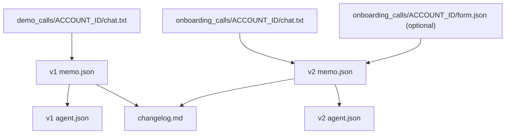

## Clara Answers Intern Assignment – Automation Pipeline

Local, zero-cost pipeline that turns demo + onboarding transcripts into versioned JSON artifacts:

- `memo.json`: structured account memo
- `agent.json`: Retell agent draft spec
- `changelog.md`: v1 → v2 changes

**Author**: Shreya Kumari

---

### Data flow (high level)



---

### Project layout

```text
clara-automation-pipeline/
  demo_calls/<account_id>/chat.txt
  onboarding_calls/<account_id>/chat.txt
  onboarding_calls/<account_id>/form.json        (optional)
  scripts/
  workflows/
  outputs/
```

---

### Setup (Windows / PowerShell)

```powershell
cd "D:\ZenAI trade\clara-automation-pipeline"
python -m venv .venv
. .venv/Scripts/Activate.ps1
python --version
```

No third‑party packages are required (stdlib only).

---

### Run (batch)

```powershell
python scripts/run_all.py
```

This scans `demo_calls/` and processes every `<account_id>` folder it finds.

---

### Outputs (per account)

For each `<account_id>`:

- **v1 (demo)**:
  - `outputs/accounts/<account_id>/v1/memo.json`
  - `outputs/accounts/<account_id>/v1/agent.json`
- **v2 (onboarding)** (only if onboarding data exists):
  - `outputs/accounts/<account_id>/v2/memo.json`
  - `outputs/accounts/<account_id>/v2/agent.json`
  - `outputs/accounts/<account_id>/v2/changelog.md`

Operational artifacts:

- `outputs/pipeline.log` (run log)
- `outputs/accounts/<account_id>/pipeline.log` (per-account log)
- `outputs/tasks.json` (local “task tracker” records)

The pipeline is **idempotent**: rerunning overwrites the same output paths.

---

### Extraction rules (important)

- The pipeline **does not invent** missing information.
- Missing items are left empty and listed under `questions_or_unknowns`.
- Onboarding transcript/form values **override** demo values.
- Conflicts/overrides are recorded in `notes`.

---

### Retell (manual import)

This repo generates a “draft spec” (`agent.json`). If you can’t create agents via Retell API on free tier, import manually:

- Create a new agent in Retell UI
- Copy/paste:
  - `agent_name`
  - `voice_style`
  - `system_prompt`

`tool_invocation_placeholders` are internal placeholders only.

---

### n8n (optional, local)

```powershell
docker-compose up -d
```

Import `workflows/n8n_workflow.json` in n8n (`http://localhost:5678`). The workflow runs the batch job inside the container.

---

### Notes / limitations

- Transcript parsing is heuristic (regex/keywords). If a transcript is vague, you’ll see more items in `questions_or_unknowns`.
- Audio transcription is intentionally out of scope; provide `chat.txt` transcripts as input.
